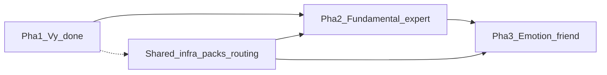

# Companion AI — Kế hoạch tổng thể

> Roadmap nhân vật đồng hành trong VStock.  
> Cập nhật: 2026-07-22 — **Vy (pha 1) tạm chốt**; hai nhân vật tiếp theo ở backlog.

---

## 1. Tầm nhìn

Companion AI không phải một chatbot chung, mà **nhiều nhân vật** — mỗi người một vai trò, knowledge pack, và mức độ “nặng” về data / model khác nhau.

| Nhân vật | Vai trò | Trọng tâm |
|----------|---------|-----------|
| **Vy** | Đồng hành thị trường | Giá, watchlist, tin ngắn, PE/KQKD cơ bản, nudge |
| **(TBD) Chuyên gia fundamental** | Tư vấn sâu BCTC / định giá | Data tài chính + báo chí giàu hơn, AI hiệu suất cao hơn |
| **(TBD) Virtual friend cảm xúc** | Bạn tinh thần | Bonding cảm xúc, mood, ít thao tác thị trường hơn Vy |

Nguyên tắc chung:

- Không ra lệnh mua/bán; góc nhìn tham khảo.
- Mutate watchlist luôn qua **pop-up confirm** trên app.
- Mỗi character = 1 pack (`data_sources` + `system_instruction`) + avatar/UI client.
- Bond / nickname / activity lưu **local** (AsyncStorage) theo `characterId`.

---

## 2. Kiến trúc nền (đã có)

```
App (Expo)
  CompanionChatScreen / Profile / Nudge / FAB
       │
       ▼
  POST /v1/companion/chat (+ nudge, health)
       │
       ├─ enrich_context_with_market   ← theo pack.data_sources
       ├─ classify_watchlist_intent    ← Intent LLM + guard
       ├─ Gemini agent (+ tools watchlist khi execute_*)
       └─ bondNotes (định kỳ) → client evolveBond / activityStore
```

**File chính**

| Lớp | Path |
|-----|------|
| Packs | `backend/app/services/companion_packs.py` |
| Chat / enrich | `backend/app/services/companion.py` |
| Intent | `backend/app/services/companion_intent.py` |
| Prompt + format context | `backend/app/services/gemini_companion.py` |
| Watchlist actions | `backend/app/services/companion_watchlist.py` |
| Characters UI | `src/companion/characters.ts` |
| Bond / chat store | `src/companion/chatStore.ts` |
| Activity history | `src/companion/activityStore.ts` |
| Deploy GCE | `scripts/deploy-companion-gce.sh` |

Thêm nhân vật mới: đăng ký pack → avatar + routing client → (tuỳ chọn) enricher / model riêng.

---

## 3. Pha 1 — Vy (đã làm, tạm dừng)

**Mục tiêu:** đồng hành phiên giao dịch — đọc list, giải thích biến động, tin ngắn, định giá/KQKD cơ bản, gợi ý giữ/gỡ (có confirm).

### Đã ship

- [x] Chat Gemini + presence / reveal bubble
- [x] Enrich: quotes, indices, news (summary), fundamentals/income (focus ≤3 mã), watchlist movers
- [x] 5 câu hỏi lõi (prompt + chips + context blocks)
- [x] Intent LLM: chat / status / propose / execute_* + guard (KQKD ≠ xóa, performance ≠ status)
- [x] Watchlist tools + pop-up confirm (thêm / xóa / tạo list)
- [x] Nudge (movers, recall)
- [x] Bond: nickname (profile + “gọi tôi là …”), notes, symbolsOfInterest
- [x] Activity history trên profile (thêm/xóa mã, tạo list, đổi biệt danh)
- [x] Tối ưu FlatList khi stream trả lời

### Không làm tiếp trên Vy (trừ bug nóng)

- Crawl full body tin / foreign flow / order book
- Character thứ hai trong cùng luồng Vy
- Backend persistence bond (vẫn local)

---

## 4. Pha 2 — Chuyên gia fundamental *(backlog)*

**Task đã thống nhất với product (2026-07-22):**

> Một nhân vật chuyên gia có thể tư vấn sâu về fundamental → phải **làm giàu / làm mới** thông tin tài chính và báo chí, đồng thời có **hệ thống AI hiệu suất hơn**.

### Hướng làm (dự kiến)

1. **Character + pack mới** (tạm gọi *An* trong code cũ đã phác)  
   - `data_sources`: fundamentals, income (rộng hơn), news sâu, quotes nhẹ  
   - Persona: rõ ràng, số liệu trước; vẫn cấm lệnh mua/bán cứng

2. **Data giàu hơn / mới hơn**  
   - PE, EPS, P/B, ROE/ROA, vốn hóa (đã có) + chuỗi nhiều năm / nhiều quý  
   - Có thể: biên lãi, tăng trưởng YoY/QoQ, so sánh peer ngành  
   - Tin: summary dài hơn, lọc theo mã/ngành, ưu tiên tin tài chính (BCTC, cổ tức, phát hành…)  
   - TTL / refresh chủ động hơn cho BCTC (ingestion job)

3. **AI hiệu suất hơn**  
   - Model / temperature / max tokens riêng cho pack này  
   - Context pack có cấu trúc (bảng số → nhận xét ngắn)  
   - Có thể tách pipeline: retrieve số liệu → LLM chỉ diễn giải (giảm hallucination)

4. **Client**  
   - Avatar, greeting, profile expertise  
   - Chọn nhân vật (FAB / sheet) hoặc deep-link từ màn Detail “Hỏi chuyên gia”

5. **Routing**  
   - Câu hỏi kiểu KQKD / định giá sâu → ưu tiên chuyên gia  
   - Câu hỏi phiên / watchlist mutate → vẫn Vy

### Tiêu chí xong pha 2

- [ ] Trả lời được “phân tích định giá / KQKD [mã]” với số mới, có nguồn trong context  
- [ ] Không bịa số khi enrich thiếu  
- [ ] Latency chấp nhận được trên GCE (p95 đo được)  
- [ ] Tách rõ với Vy trên UI

---

## 5. Pha 3 — Virtual friend cảm xúc *(backlog)*

**Task đã thống nhất với product (2026-07-22):**

> Một nhân vật kiểu như Vy nhưng **quan tâm hơn vào emotion** của người dùng — virtual friend có bonding về tinh thần.

### Hướng làm (dự kiến)

1. **Pack nhẹ data thị trường** — ít quotes/tools; không khuyến khích mutate watchlist  
2. **Bonding sâu**  
   - Mood check-in, notes cảm xúc, nickname, “nhớ” lần trước  
   - Có thể mở rộng activity: chia sẻ cảm xúc, streak trò chuyện  
3. **Prompt**  
   - Empathy-first, không trị liệu lâm sàng, không thay thế chuyên gia sức khỏe  
   - Thị trường chỉ là ngữ cảnh nhẹ nếu user nhắc  
4. **An toàn**  
   - Guardrail khi user nói về khủng hoảng / tự hại → chuyển hướng hỗ trợ phù hợp (policy riêng)

### Tiêu chí xong pha 3

- [ ] User cảm nhận “được lắng nghe” qua nhiều phiên (bond notes hữu ích)  
- [ ] Ít / không hiện pop-up watchlist trừ khi user chủ động nhờ  
- [ ] Tách rõ brand với Vy (giọng, avatar, expertise trên profile)

---

## 6. Thứ tự gợi ý



1. Giữ Vy ổn định (chỉ fix bug / regress).  
2. Làm **pha 2** khi cần chiều sâu BCTC trên Detail / Companion.  
3. Làm **pha 3** khi muốn tăng retention cảm xúc, tách khỏi “bạn ngồi cạnh bảng giá”.

---

## 7. Ghi chú vận hành

- Companion API: GCE `scripts/deploy-companion-gce.sh` (sau khi push `main`).  
- Client features (nickname, activity, FlatList): cần build/reload Expo — không phụ thuộc container API.  
- Docs liên quan: `docs/DEPLOY-GCE.md` (mục Companion), `docs/ARCHITECTURE.md` (data sources).
